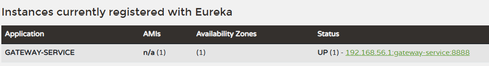
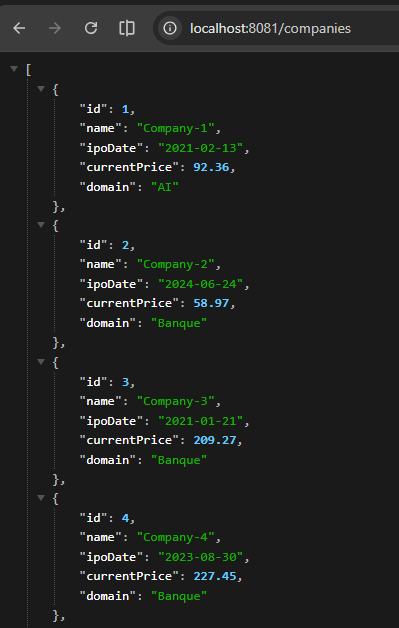
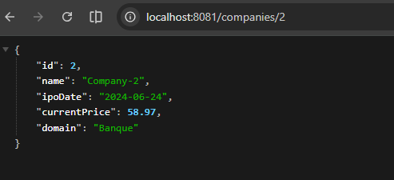

# Test Systèmes Distribués

## Question 1
Créer un Project Maven incluant les micro-services suivants : company-service, stock-service, chat-bot-service, gateway-service et discovery-service.


## Question 2
Établir une architecture technique du projet.

## Question 3
Développer et tester les micro-services discovery-service et gateway-service.

Colonnes ajoutées / configuration :
- discovery-service : port 8761, Eureka server, register/fetch disabled.
- gateway-service : port 8888, Eureka client, discovery locator activé, routes vers `lb://company-service` (`/companies/**`) et `lb://stock-service` (`/stocks/**`).



## Question 4
Développer et tester le micro-service company-service.

Implémentation  :
1) Entité + Repository
```java
@Entity @Table(name = "companies")
@Data @NoArgsConstructor @AllArgsConstructor @Builder
public class Company {
  @Id @GeneratedValue(strategy = GenerationType.IDENTITY)
  private Long id;
  @Column(nullable = false, unique = true)
  private String name;
  private LocalDate ipoDate;
  @Column(precision = 19, scale = 4)
  private BigDecimal currentPrice;
  private String domain;
}
```
2) DTOs + Mapper
```java
@Data @NoArgsConstructor @AllArgsConstructor @Builder
public class CompanyDTO { Long id; String name; LocalDate ipoDate; BigDecimal currentPrice; String domain; }

public static CompanyDTO toDto(Company c) { ... }
public static Company toEntity(CompanyDTO dto) { ... }
public static void updateEntity(Company c, CompanyDTO dto) { ... }
```
3) Service
```java
public interface CompanyService { create/delete/updatePrice/findAll/findById/findByDomain; }

@Service
public class CompanyServiceImpl implements CompanyService {
  public CompanyDTO updatePrice(Long id, BigDecimal newPrice) {
    Company company = repo.findById(id).orElseThrow(...);
    company.setCurrentPrice(newPrice);
    return CompanyMapper.toDto(company);
  }
}
```
4) Controller REST `/companies`
```java
@RestController
@RequestMapping("/companies")
public class CompanyController {
  @PostMapping public ResponseEntity<CompanyDTO> create(@RequestBody CompanyDTO request) { ... }
  @DeleteMapping("/{id}") public void delete(@PathVariable Long id) { ... }
  @PutMapping("/{id}/price") public CompanyDTO updatePrice(@PathVariable Long id, @RequestBody PriceUpdateRequest req) { ... }
  @GetMapping public List<CompanyDTO> findAll() { ... }
  @GetMapping("/{id}") public CompanyDTO findById(@PathVariable Long id) { ... }
  @GetMapping("/domain/{domain}") public List<CompanyDTO> findByDomain(@PathVariable String domain) { ... }
}
```
5) Config `application.properties` : port 8081, H2 en mémoire, JPA ddl-auto update, Eureka client.
6) Seed : insertion de 5 companies aléatoires au démarrage si base vide.

Tests :
affichage de la liste des companies et d'une company par id via le gateway-service.




